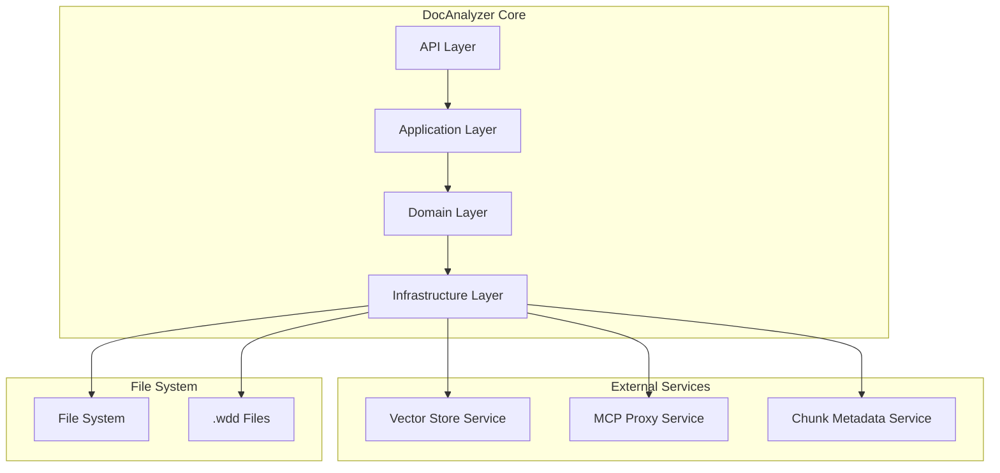
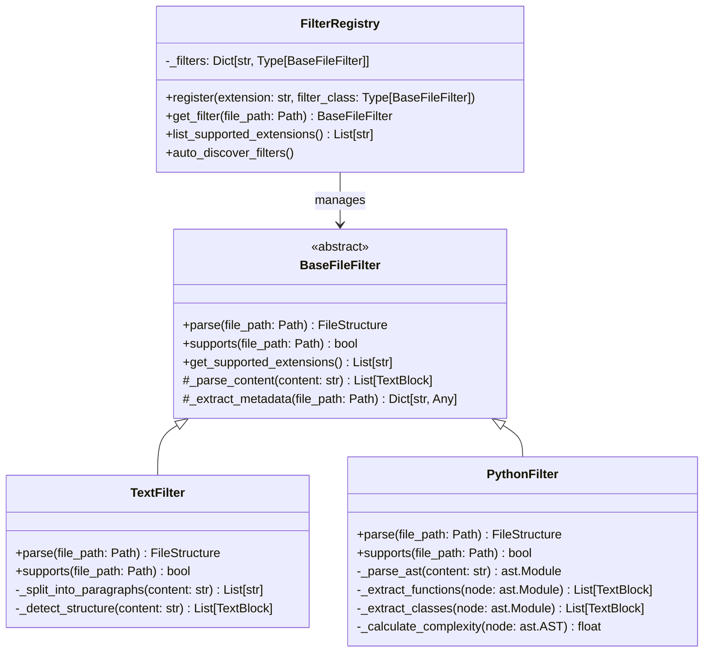
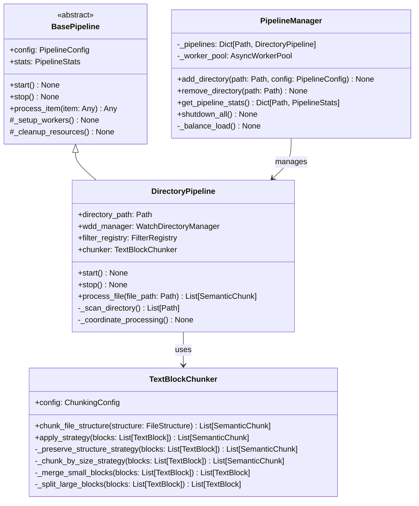
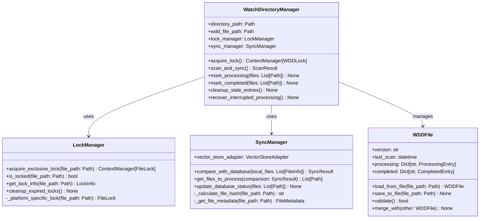
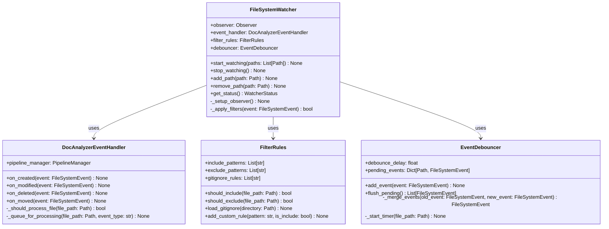
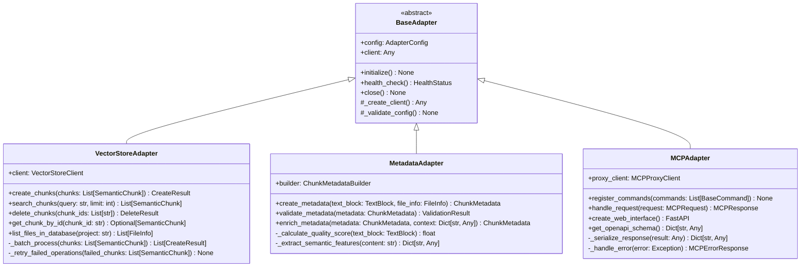
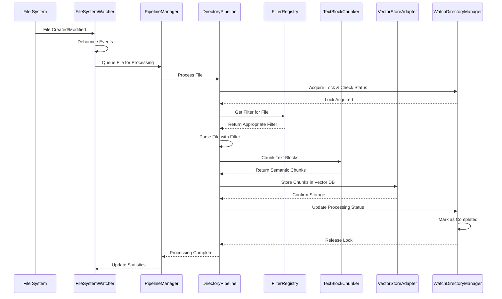

# Архитектурные стандарты DocAnalyzer

## 1. Общие архитектурные принципы

### 1.1 Фундаментальные принципы
- **Асинхронность**: Все операции I/O выполняются асинхронно для максимальной производительности
- **Модульность**: Четкое разделение ответственности между компонентами с минимальной связанностью
- **Расширяемость**: Возможность добавления новых типов файлов, процессоров и адаптеров без изменения ядра
- **Отказоустойчивость**: Graceful degradation и автоматическое восстановление после сбоев
- **Наблюдаемость**: Комплексное логирование, метрики и трассировка для мониторинга системы

### 1.2 Архитектурные паттерны
- **Adapter Pattern**: Для интеграции с внешними сервисами (vector_store_client, chunk_metadata_adapter)
- **Strategy Pattern**: Для различных стратегий чанкования и обработки файлов
- **Observer Pattern**: Для мониторинга файловой системы и событийной архитектуры
- **Factory Pattern**: Для создания фильтров и процессоров по типу файла
- **Command Pattern**: Для MCP команд с возможностью отмены и повтора

### 1.3 Принципы SOLID
- **Single Responsibility**: Каждый класс имеет одну четко определенную ответственность
- **Open/Closed**: Открыт для расширения, закрыт для модификации
- **Liskov Substitution**: Подклассы могут заменять базовые классы без нарушения функциональности
- **Interface Segregation**: Множество специализированных интерфейсов лучше одного универсального
- **Dependency Inversion**: Зависимость от абстракций, а не от конкретных реализаций

## 2. Системная архитектура

### 2.1 Высокоуровневая архитектура



### 2.2 Слоевая архитектура

#### API Layer (Уровень API)
- **Назначение**: Внешний интерфейс для взаимодействия с системой
- **Компоненты**: MCP команды, REST endpoints, CLI интерфейс
- **Ответственность**: Валидация запросов, сериализация ответов, маршрутизация

#### Application Layer (Уровень приложения)
- **Назначение**: Оркестрация бизнес-процессов и координация компонентов
- **Компоненты**: DocAnalyzerApp, PipelineManager, CommandHandlers
- **Ответственность**: Управление жизненным циклом, координация потоков выполнения

#### Domain Layer (Доменный уровень)
- **Назначение**: Бизнес-логика и доменные модели
- **Компоненты**: Filters, Pipeline, WDD Manager, Chunkers
- **Ответственность**: Основная логика обработки файлов, валидация бизнес-правил

#### Infrastructure Layer (Уровень инфраструктуры)
- **Назначение**: Технические детали и внешние интеграции
- **Компоненты**: Adapters, File System Watcher, Persistence, Logging
- **Ответственность**: Взаимодействие с внешними системами, техническая поддержка

## 3. Компонентная архитектура

### 3.1 Система фильтров файлов



#### Принципы проектирования фильтров:
1. **Единая ответственность**: Каждый фильтр отвечает за один тип файлов
2. **Полиморфизм**: Все фильтры реализуют единый интерфейс BaseFileFilter
3. **Расширяемость**: Новые фильтры добавляются через наследование и регистрацию
4. **Кэширование**: Результаты парсинга кэшируются для повторного использования

### 3.2 Система пайплайнов обработки



#### Принципы проектирования пайплайнов:
1. **Asynchronous Processing**: Все операции выполняются асинхронно
2. **Worker Pool Pattern**: Использование пула воркеров для параллельной обработки
3. **Backpressure Handling**: Управление нагрузкой при высоком объеме файлов
4. **Error Isolation**: Ошибки в одном пайплайне не влияют на другие

### 3.3 Система координации через .wdd файлы



#### Принципы проектирования WDD системы:
1. **Exclusive Locking**: Предотвращение конфликтов при параллельной обработке
2. **Atomic Operations**: Операции с .wdd файлами выполняются атомарно
3. **Recovery Mechanisms**: Автоматическое восстановление после сбоев
4. **Cross-Platform Compatibility**: Работа на различных операционных системах

### 3.4 Система мониторинга файлов



#### Принципы проектирования мониторинга:
1. **Event-Driven Architecture**: Реакция на события файловой системы
2. **Debouncing**: Объединение частых изменений в один сигнал
3. **Filtering**: Пропуск нерелевантных файлов и событий
4. **Graceful Degradation**: Продолжение работы при временных проблемах

## 4. Интеграционная архитектура

### 4.1 Система адаптеров



#### Принципы проектирования адаптеров:
1. **Abstraction Layer**: Изоляция от деталей внешних API
2. **Retry Logic**: Автоматическое восстановление при временных сбоях
3. **Circuit Breaker**: Защита от каскадных отказов внешних сервисов
4. **Configuration-Driven**: Настройка через конфигурационные файлы

### 4.2 Поток данных в системе



## 5. Паттерны обработки ошибок

### 5.1 Иерархия исключений

```python
class DocAnalyzerError(Exception):
    """Base exception with structured error information."""
    
    def __init__(
        self, 
        message: str, 
        details: Optional[Dict[str, Any]] = None,
        recoverable: bool = True,
        retry_after: Optional[int] = None
    ):
        super().__init__(message)
        self.message = message
        self.details = details or {}
        self.recoverable = recoverable
        self.retry_after = retry_after
        self.timestamp = datetime.now(timezone.utc)
        self.error_id = str(uuid4())
    
    def to_dict(self) -> Dict[str, Any]:
        """Convert to structured format for logging/API."""
        return {
            'error_id': self.error_id,
            'error_type': self.__class__.__name__,
            'message': self.message,
            'details': self.details,
            'recoverable': self.recoverable,
            'retry_after': self.retry_after,
            'timestamp': self.timestamp.isoformat()
        }

class FilterError(DocAnalyzerError):
    """File filtering and parsing errors."""
    pass

class ChunkingError(DocAnalyzerError):
    """Text chunking process errors."""
    pass

class PipelineError(DocAnalyzerError):
    """Pipeline execution errors."""
    pass

class VectorStoreError(DocAnalyzerError):
    """Vector store operation errors."""
    pass

class ConfigurationError(DocAnalyzerError):
    """Configuration validation errors."""
    
    def __init__(self, message: str, field: str, value: Any):
        super().__init__(message, recoverable=False)
        self.details['field'] = field
        self.details['invalid_value'] = str(value)
```

### 5.2 Паттерны восстановления после ошибок

#### Circuit Breaker Pattern:
```python
class CircuitBreaker:
    """Circuit breaker for external service calls."""
    
    def __init__(
        self, 
        failure_threshold: int = 5,
        recovery_timeout: int = 60,
        expected_exception: Type[Exception] = Exception
    ):
        self.failure_threshold = failure_threshold
        self.recovery_timeout = recovery_timeout
        self.expected_exception = expected_exception
        self.failure_count = 0
        self.last_failure_time: Optional[datetime] = None
        self.state = CircuitState.CLOSED
    
    def __call__(self, func):
        @wraps(func)
        async def wrapper(*args, **kwargs):
            if self.state == CircuitState.OPEN:
                if self._should_attempt_reset():
                    self.state = CircuitState.HALF_OPEN
                else:
                    raise CircuitBreakerOpenError(
                        f"Circuit breaker open for {func.__name__}"
                    )
            
            try:
                result = await func(*args, **kwargs)
                self._on_success()
                return result
            except self.expected_exception as e:
                self._on_failure()
                raise
        
        return wrapper
    
    def _should_attempt_reset(self) -> bool:
        return (
            self.last_failure_time and
            datetime.now() - self.last_failure_time > timedelta(seconds=self.recovery_timeout)
        )
    
    def _on_success(self) -> None:
        self.failure_count = 0
        self.state = CircuitState.CLOSED
    
    def _on_failure(self) -> None:
        self.failure_count += 1
        self.last_failure_time = datetime.now()
        
        if self.failure_count >= self.failure_threshold:
            self.state = CircuitState.OPEN
```

#### Retry with Exponential Backoff:
```python
class RetryHandler:
    """Configurable retry mechanism with backoff strategies."""
    
    def __init__(
        self,
        max_retries: int = 3,
        base_delay: float = 1.0,
        max_delay: float = 60.0,
        backoff_factor: float = 2.0,
        jitter: bool = True
    ):
        self.max_retries = max_retries
        self.base_delay = base_delay
        self.max_delay = max_delay
        self.backoff_factor = backoff_factor
        self.jitter = jitter
    
    async def execute(
        self,
        func: Callable[..., Awaitable[T]],
        *args,
        retryable_exceptions: Tuple[Type[Exception], ...] = (Exception,),
        **kwargs
    ) -> T:
        last_exception = None
        
        for attempt in range(self.max_retries + 1):
            try:
                return await func(*args, **kwargs)
            except retryable_exceptions as e:
                last_exception = e
                
                if attempt == self.max_retries:
                    break
                
                delay = self._calculate_delay(attempt)
                logger.warning(
                    f"Attempt {attempt + 1} failed, retrying in {delay:.2f}s: {e}"
                )
                await asyncio.sleep(delay)
        
        raise RetryExhaustedError(
            f"All {self.max_retries} retry attempts failed"
        ) from last_exception
    
    def _calculate_delay(self, attempt: int) -> float:
        delay = self.base_delay * (self.backoff_factor ** attempt)
        delay = min(delay, self.max_delay)
        
        if self.jitter:
            delay *= (0.5 + random.random() * 0.5)  # 50-100% of calculated delay
        
        return delay
```

## 6. Асинхронная архитектура

### 6.1 Concurrency Patterns

#### Worker Pool для обработки файлов:
```python
class AsyncFileProcessor:
    """Asynchronous file processor with configurable concurrency."""
    
    def __init__(
        self,
        max_workers: int = 4,
        queue_size: int = 1000,
        batch_size: int = 10
    ):
        self.max_workers = max_workers
        self.queue_size = queue_size
        self.batch_size = batch_size
        
        self.input_queue: asyncio.Queue = asyncio.Queue(maxsize=queue_size)
        self.result_queue: asyncio.Queue = asyncio.Queue()
        self.workers: List[asyncio.Task] = []
        self.running = False
    
    async def start(self) -> None:
        """Start worker pool."""
        self.running = True
        self.workers = [
            asyncio.create_task(self._worker(f"worker-{i}"))
            for i in range(self.max_workers)
        ]
    
    async def stop(self) -> None:
        """Gracefully stop worker pool."""
        self.running = False
        
        # Send stop signals to workers
        for _ in range(self.max_workers):
            await self.input_queue.put(None)
        
        # Wait for workers to finish
        await asyncio.gather(*self.workers, return_exceptions=True)
    
    async def submit_file(self, file_path: Path) -> None:
        """Submit file for processing."""
        await self.input_queue.put(file_path)
    
    async def get_result(self) -> ProcessingResult:
        """Get processing result."""
        return await self.result_queue.put()
    
    async def _worker(self, worker_name: str) -> None:
        """Worker coroutine."""
        batch = []
        
        while self.running:
            try:
                # Collect batch of files
                for _ in range(self.batch_size):
                    item = await asyncio.wait_for(
                        self.input_queue.get(), 
                        timeout=1.0
                    )
                    
                    if item is None:  # Stop signal
                        break
                    
                    batch.append(item)
                
                if batch:
                    results = await self._process_batch(batch, worker_name)
                    for result in results:
                        await self.result_queue.put(result)
                    batch.clear()
                    
            except asyncio.TimeoutError:
                # No items in queue, continue
                pass
            except Exception as e:
                logger.error(f"Worker {worker_name} error: {e}")
    
    async def _process_batch(
        self, 
        file_paths: List[Path], 
        worker_name: str
    ) -> List[ProcessingResult]:
        """Process batch of files."""
        tasks = [
            self._process_single_file(file_path, worker_name)
            for file_path in file_paths
        ]
        
        results = await asyncio.gather(*tasks, return_exceptions=True)
        return [r for r in results if not isinstance(r, Exception)]
```

#### Event-Driven Communication:
```python
class EventBus:
    """Asynchronous event bus for component communication."""
    
    def __init__(self):
        self._subscribers: Dict[str, List[Callable]] = defaultdict(list)
        self._event_queue: asyncio.Queue = asyncio.Queue()
        self._processor_task: Optional[asyncio.Task] = None
        self._running = False
    
    async def start(self) -> None:
        """Start event processing."""
        self._running = True
        self._processor_task = asyncio.create_task(self._process_events())
    
    async def stop(self) -> None:
        """Stop event processing."""
        self._running = False
        if self._processor_task:
            self._processor_task.cancel()
            try:
                await self._processor_task
            except asyncio.CancelledError:
                pass
    
    def subscribe(self, event_type: str, handler: Callable) -> None:
        """Subscribe to event type."""
        self._subscribers[event_type].append(handler)
    
    def unsubscribe(self, event_type: str, handler: Callable) -> None:
        """Unsubscribe from event type."""
        if handler in self._subscribers[event_type]:
            self._subscribers[event_type].remove(handler)
    
    async def publish(self, event: Event) -> None:
        """Publish event asynchronously."""
        await self._event_queue.put(event)
    
    async def _process_events(self) -> None:
        """Process events from queue."""
        while self._running:
            try:
                event = await asyncio.wait_for(
                    self._event_queue.get(),
                    timeout=1.0
                )
                
                handlers = self._subscribers.get(event.type, [])
                if handlers:
                    # Process handlers concurrently
                    tasks = [
                        self._safe_call_handler(handler, event)
                        for handler in handlers
                    ]
                    await asyncio.gather(*tasks, return_exceptions=True)
                    
            except asyncio.TimeoutError:
                continue
            except Exception as e:
                logger.error(f"Event processing error: {e}")
    
    async def _safe_call_handler(self, handler: Callable, event: Event) -> None:
        """Safely call event handler."""
        try:
            if asyncio.iscoroutinefunction(handler):
                await handler(event)
            else:
                handler(event)
        except Exception as e:
            logger.error(f"Handler {handler.__name__} failed for event {event.type}: {e}")
```

## 7. Производительность и масштабирование

### 7.1 Стратегии оптимизации

#### Memory Management:
```python
class MemoryOptimizedProcessor:
    """File processor with memory optimization strategies."""
    
    def __init__(self, max_memory_mb: int = 500):
        self.max_memory_mb = max_memory_mb
        self._memory_monitor = MemoryMonitor(max_memory_mb)
        self._chunk_cache: Dict[str, WeakValueDictionary] = {}
    
    async def process_large_file(self, file_path: Path) -> List[SemanticChunk]:
        """Process large file with memory streaming."""
        chunks = []
        
        async with aiofiles.open(file_path, 'r', encoding='utf-8') as file:
            buffer = ""
            chunk_size = 8192  # 8KB chunks
            
            async for chunk in self._read_in_chunks(file, chunk_size):
                buffer += chunk
                
                # Process complete blocks when buffer gets large
                if len(buffer) > 100000:  # 100KB threshold
                    processed_chunks = await self._process_buffer(buffer[:50000])
                    chunks.extend(processed_chunks)
                    buffer = buffer[50000:]  # Keep overlap
                    
                    # Check memory usage
                    if self._memory_monitor.usage_mb > self.max_memory_mb * 0.8:
                        await self._force_garbage_collection()
            
            # Process remaining buffer
            if buffer:
                processed_chunks = await self._process_buffer(buffer)
                chunks.extend(processed_chunks)
        
        return chunks
    
    async def _read_in_chunks(self, file, chunk_size: int):
        """Read file in small chunks to control memory usage."""
        while True:
            chunk = await file.read(chunk_size)
            if not chunk:
                break
            yield chunk
    
    async def _force_garbage_collection(self) -> None:
        """Force garbage collection and log memory usage."""
        import gc
        collected = gc.collect()
        logger.debug(f"Garbage collection freed {collected} objects")
        
        current_usage = self._memory_monitor.usage_mb
        logger.debug(f"Memory usage after GC: {current_usage}MB")
```

#### Caching Strategy:
```python
class SmartCache:
    """Intelligent caching with TTL and memory limits."""
    
    def __init__(
        self,
        max_size: int = 1000,
        ttl_seconds: int = 3600,
        max_memory_mb: int = 100
    ):
        self.max_size = max_size
        self.ttl_seconds = ttl_seconds
        self.max_memory_mb = max_memory_mb
        
        self._cache: Dict[str, CacheEntry] = {}
        self._access_order: List[str] = []
        self._lock = asyncio.RLock()
    
    async def get(self, key: str) -> Optional[Any]:
        """Get value from cache."""
        async with self._lock:
            entry = self._cache.get(key)
            if not entry:
                return None
            
            if self._is_expired(entry):
                await self._remove(key)
                return None
            
            # Update access order (LRU)
            self._access_order.remove(key)
            self._access_order.append(key)
            
            entry.access_count += 1
            entry.last_accessed = datetime.now()
            
            return entry.value
    
    async def set(self, key: str, value: Any) -> None:
        """Set value in cache."""
        async with self._lock:
            # Remove if exists
            if key in self._cache:
                await self._remove(key)
            
            # Check size limits
            await self._ensure_capacity()
            
            # Add new entry
            entry = CacheEntry(
                value=value,
                created_at=datetime.now(),
                last_accessed=datetime.now(),
                access_count=1,
                size_bytes=sys.getsizeof(value)
            )
            
            self._cache[key] = entry
            self._access_order.append(key)
    
    async def _ensure_capacity(self) -> None:
        """Ensure cache doesn't exceed limits."""
        # Check memory limit
        total_memory = sum(entry.size_bytes for entry in self._cache.values())
        memory_mb = total_memory / 1024 / 1024
        
        while (
            len(self._cache) >= self.max_size or 
            memory_mb > self.max_memory_mb
        ):
            # Remove least recently used
            if self._access_order:
                oldest_key = self._access_order[0]
                await self._remove(oldest_key)
                
                total_memory = sum(entry.size_bytes for entry in self._cache.values())
                memory_mb = total_memory / 1024 / 1024
            else:
                break
    
    def _is_expired(self, entry: CacheEntry) -> bool:
        """Check if cache entry is expired."""
        age = datetime.now() - entry.created_at
        return age.total_seconds() > self.ttl_seconds
```

### 7.2 Monitoring и Metrics

#### Performance Metrics:
```python
class PerformanceMonitor:
    """Comprehensive performance monitoring."""
    
    def __init__(self):
        self.metrics: Dict[str, MetricCollector] = {}
        self._start_time = time.time()
    
    def register_metric(self, name: str, metric_type: str) -> None:
        """Register new metric."""
        if metric_type == 'counter':
            self.metrics[name] = CounterMetric()
        elif metric_type == 'histogram':
            self.metrics[name] = HistogramMetric()
        elif metric_type == 'gauge':
            self.metrics[name] = GaugeMetric()
    
    def increment_counter(self, name: str, value: float = 1.0) -> None:
        """Increment counter metric."""
        if name in self.metrics:
            self.metrics[name].increment(value)
    
    def record_duration(self, name: str, duration: float) -> None:
        """Record duration in histogram."""
        if name in self.metrics:
            self.metrics[name].record(duration)
    
    def set_gauge(self, name: str, value: float) -> None:
        """Set gauge value."""
        if name in self.metrics:
            self.metrics[name].set(value)
    
    def get_system_metrics(self) -> Dict[str, Any]:
        """Get comprehensive system metrics."""
        process = psutil.Process()
        
        return {
            'uptime_seconds': time.time() - self._start_time,
            'memory': {
                'rss_mb': process.memory_info().rss / 1024 / 1024,
                'vms_mb': process.memory_info().vms / 1024 / 1024,
                'percent': process.memory_percent(),
            },
            'cpu': {
                'percent': process.cpu_percent(),
                'num_threads': process.num_threads(),
            },
            'files': {
                'open_files': len(process.open_files()),
                'connections': len(process.connections()),
            },
            'custom_metrics': {
                name: metric.get_value()
                for name, metric in self.metrics.items()
            }
        }

# Context manager for timing operations
@contextmanager
def timer(monitor: PerformanceMonitor, metric_name: str):
    """Context manager for timing operations."""
    start_time = time.time()
    try:
        yield
    finally:
        duration = time.time() - start_time
        monitor.record_duration(metric_name, duration)
```

## 8. Заключение

### 8.1 Ключевые архитектурные решения
- **Асинхронная архитектура** обеспечивает высокую производительность при обработке множества файлов
- **Модульный дизайн** позволяет легко расширять функциональность и заменять компоненты
- **Система координации** предотвращает дублирование работы между экземплярами
- **Robust error handling** обеспечивает надежность и восстановление после сбоев
- **Observability** позволяет мониторить производительность и диагностировать проблемы

### 8.2 Преимущества архитектуры
- **Масштабируемость**: Система может обрабатывать большие объемы файлов
- **Надежность**: Устойчивость к сбоям и автоматическое восстановление
- **Гибкость**: Легкое добавление новых типов файлов и процессоров
- **Производительность**: Оптимизированная обработка с контролем ресурсов
- **Наблюдаемость**: Комплексный мониторинг и логирование

### 8.3 Следующие шаги
После определения архитектурных стандартов можно приступать к реализации компонентов согласно плану реализации, начиная с базовых абстракций и постепенно переходя к конкретным реализациям и интеграциям. 