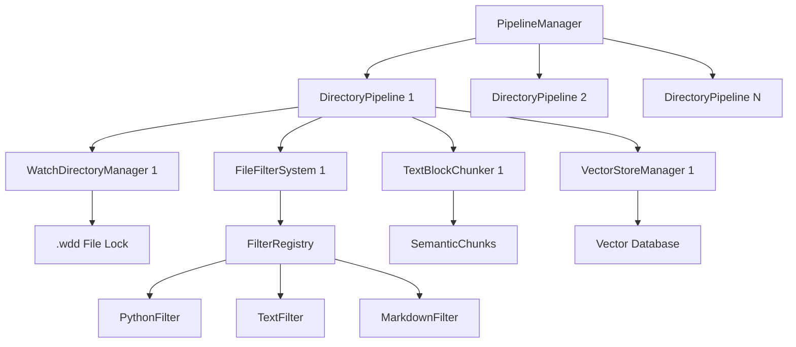

# Техническое задание: Сервер DocAnalyzer

## 1. Обзор проекта

### 1.1 Назначение
DocAnalyzer - это сервер для автоматического мониторинга файловой системы, который отслеживает указанные каталоги рекурсивно, автоматически чанкует новые файлы и записывает их в векторную базу данных для последующего семантического поиска.

### 1.2 Архитектура
Сервер использует комбинацию трех ключевых адаптеров:
- **mcp_proxy_adapter** - для генерации JSON-RPC API и создания веб-интерфейса
- **chunk_metadata_adapter** - для создания и управления метаданными чанков
- **vector_store_client** - для взаимодействия с векторным хранилищем

### 1.3 Основные функции
1. Мониторинг файловой системы в реальном времени
2. Автоматическое чанкование новых/измененных файлов
3. Создание богатых метаданных для каждого чанка
4. Отправка чанков в векторное хранилище
5. Предоставление API для управления и мониторинга
6. Веб-интерфейс для управления конфигурацией

## 2. Функциональные требования

### 2.1 Мониторинг файловой системы
- **Рекурсивное отслеживание**: Отслеживание всех файлов в указанных каталогах и подкаталогах
- **Фильтрация файлов**: Настраиваемые фильтры по расширениям, именам, размеру
- **События файловой системы**: Реакция на создание, изменение, удаление файлов
- **Исключения**: Поддержка .gitignore и пользовательских правил исключения
- **Координация обработки**: Использование `.wdd` файлов для предотвращения дублирования
- **Синхронизация с БД**: Сравнение локального состояния с векторным хранилищем

### 2.2 Обработка файлов
- **Поддерживаемые форматы**: 
  - Текстовые файлы (.txt, .md, .rst)
  - Код (.py, .js, .ts, .java, .cpp, .cs, .go, .rs)
  - Документы (.pdf, .docx, .html)
  - Конфигурационные файлы (.json, .yaml, .xml, .ini)
- **Чанкование**: Интеллигентное разбиение файлов на семантически связанные части
- **Дедупликация**: Обнаружение и предотвращение дублирования контента

### 2.3 Управление метаданными
- **Обязательные поля**: Определены в разделе 4 "Структура метаданных"
- **Автогенерация**: SHA256 хеши, UUID, временные метки
- **Контекстные данные**: Путь к файлу, проект, язык программирования

### 2.4 API и интерфейс
- **JSON-RPC API**: Полный REST API через mcp_proxy_adapter
- **Веб-интерфейс**: Управление конфигурацией и мониторинг
- **Документация**: Автогенерируемая OpenAPI документация

## 3. Технические требования

### 3.1 Архитектурные принципы
- **Асинхронность**: Все операции выполняются асинхронно
- **Модульность**: Четкое разделение ответственности между компонентами
- **Расширяемость**: Возможность добавления новых типов файлов и процессоров
- **Отказоустойчивость**: Обработка ошибок и восстановление после сбоев

### 3.2 Производительность
- **Пакетная обработка**: Обработка файлов пакетами для оптимизации производительности
- **Очередь задач**: Асинхронная очередь для обработки больших объемов файлов
- **Кэширование**: Кэширование метаданных и результатов обработки
- **Параллелизм**: Параллельная обработка независимых файлов

### 3.3 Безопасность
- **Валидация входных данных**: Строгая валидация всех входящих параметров
- **Ограничения файловой системы**: Работа только в разрешенных каталогах
- **Логирование**: Детальное логирование всех операций
- **Мониторинг**: Мониторинг производительности и ошибок

## 4. Структура метаданных

На основе анализа `chunk_metadata_adapter` и `vector_store_client`, определены следующие ключевые поля для метаданных чанков:

### 4.1 Обязательные поля
```python
# Основные идентификаторы
uuid: str                    # UUIDv4 - уникальный идентификатор чанка
source_id: str              # UUIDv4 - идентификатор источника (файла)
body: str                   # Исходный текст чанка (1-10000 символов)
embedding: List[float]      # 384-мерный вектор эмбеддинга

# Автогенерируемые поля
sha256: str                 # SHA256 хеш содержимого
created_at: str            # ISO8601 дата создания
```

### 4.2 Основные поля
```python
# Контентные поля
text: Optional[str]         # Нормализованный текст для поиска
type: ChunkType            # Тип чанка (DocBlock, CodeBlock, Message, etc.)
language: LanguageEnum     # Язык контента (en, ru, python, etc.)
role: ChunkRole           # Роль в системе (user, system, assistant)
status: ChunkStatus       # Статус обработки (new, processed, error)

# Структурные поля
ordinal: Optional[int]     # Порядковый номер в документе
start: Optional[int]       # Начальная позиция в исходном файле
end: Optional[int]         # Конечная позиция в исходном файле
```

### 4.3 Файловые метаданные
```python
# Путь и источник
source_path: Optional[str]          # Полный путь к исходному файлу
source_lines_start: Optional[int]   # Начальная строка в файле
source_lines_end: Optional[int]     # Конечная строка в файле

# Контекст проекта
project: Optional[str]              # Название проекта (max 128 символов)
category: Optional[str]             # Категория файла (max 64 символа)
```

### 4.4 Метаданные качества
```python
# Метрики качества чанка
quality_score: Optional[float]      # Оценка качества (0.0-1.0)
coverage: Optional[float]           # Покрытие темы (0.0-1.0)
cohesion: Optional[float]          # Связность контента (0.0-1.0)

# Использование
matches: Optional[int]              # Количество совпадений в поиске
used_in_generation: bool           # Использовался ли в генерации
used_as_context: bool             # Использовался ли как контекст
```

### 4.5 Бизнес-поля
```python
# Дополнительная классификация
title: Optional[str]               # Заголовок (max 256 символов)
year: Optional[int]                # Год (0-2100)
is_public: Optional[bool]          # Флаг публичности
source: Optional[str]              # Источник данных (max 64 символа)
tags: List[str]                    # Теги для классификации
```

### 4.6 Формат передачи данных в терминах SemanticChunk

Итоговый чанк, передаваемый в векторную БД, имеет следующую структуру на основе `vector_store_client.models.SemanticChunk`:

#### Полная структура SemanticChunk
```python
SemanticChunk(
    # === ОБЯЗАТЕЛЬНЫЕ ПОЛЯ ===
    body: str                              # Исходный текст чанка (1-10000 символов)
    source_id: str                         # UUIDv4 идентификатор источника (файла)
    embedding: List[float]                 # 384-мерный вектор эмбеддинга
    
    # === АВТОГЕНЕРИРУЕМЫЕ ПОЛЯ ===
    uuid: Optional[str] = None             # UUIDv4 уникальный идентификатор чанка
    sha256: Optional[str] = None           # SHA256 хеш содержимого
    created_at: Optional[str] = None       # ISO8601 дата создания
    
    # === ОСНОВНЫЕ ПОЛЯ ===
    text: Optional[str] = None             # Нормализованный текст для поиска
    type: ChunkType = ChunkType.DOC_BLOCK  # Тип чанка
    language: LanguageEnum = LanguageEnum.EN  # Язык контента
    role: ChunkRole = ChunkRole.USER       # Роль в системе
    status: ChunkStatus = ChunkStatus.NEW  # Статус обработки (новые файлы)
    
    # === ПОЗИЦИОННЫЕ ПОЛЯ ===
    ordinal: Optional[int] = None          # Порядковый номер в документе
    start: Optional[int] = None            # Начальная позиция в исходном файле
    end: Optional[int] = None              # Конечная позиция в исходном файле
    source_lines_start: Optional[int] = None  # Начальная строка в файле
    source_lines_end: Optional[int] = None    # Конечная строка в файле
    source_path: Optional[str] = None      # Полный путь к исходному файлу
    
    # === КОНТЕКСТНЫЕ ПОЛЯ ===
    project: Optional[str] = None          # Название проекта (max 128 символов)
    category: Optional[str] = None         # Категория файла (max 64 символа)
    title: Optional[str] = None            # Заголовок чанка (max 256 символов)
    
    # === МЕТРИКИ КАЧЕСТВА ===
    quality_score: Optional[float] = None     # Оценка качества (0.0-1.0)
    coverage: Optional[float] = None          # Покрытие темы (0.0-1.0)
    cohesion: Optional[float] = None          # Связность контента (0.0-1.0)
    boundary_prev: Optional[float] = None     # Граничное сходство с предыдущим
    boundary_next: Optional[float] = None     # Граничное сходство со следующим
    matches: Optional[int] = None             # Количество совпадений в поиске
    used_in_generation: bool = False          # Использовался ли в генерации
    used_as_input: bool = False              # Использовался ли как входные данные
    used_as_context: bool = False            # Использовался ли как контекст
    
    # === СТРУКТУРНЫЕ ПОЛЯ ===
    task_id: str = uuid4()                    # UUID задачи
    subtask_id: str = uuid4()                 # UUID подзадачи
    unit_id: str = uuid4()                    # UUID единицы обработки
    block_id: str = uuid4()                   # UUID блока
    block_index: Optional[int] = None         # Индекс блока
    block_type: Optional[BlockType] = BlockType.PARAGRAPH  # Тип блока
    chunking_version: Optional[str] = None    # Версия алгоритма чанкования
    
    # === ДОПОЛНИТЕЛЬНЫЕ ПОЛЯ ===
    year: Optional[int] = None                # Год (0-2100)
    is_public: Optional[bool] = None          # Флаг публичности
    source: Optional[str] = None              # Источник данных (max 64 символа)
    tags: List[str] = []                      # Теги для классификации
    summary: Optional[str] = None             # Краткое описание (max 512 символов)
)
```

#### Примеры заполненных SemanticChunk

##### Пример 1: Python функция
```python
SemanticChunk(
    # Обязательные поля
    body="def calculate_complexity(node: ast.AST) -> int:\n    \"\"\"Calculate cyclomatic complexity.\"\"\"\n    complexity = 1\n    for child in ast.walk(node):\n        if isinstance(child, (ast.If, ast.While)):\n            complexity += 1\n    return complexity",
    source_id="550e8400-e29b-41d4-a716-446655440000",  # UUID файла
    embedding=[0.1, 0.2, ..., 0.384],  # 384-мерный вектор
    
    # Автогенерируемые поля
    uuid="6ba7b810-9dad-11d1-80b4-00c04fd430c8",
    sha256="a1b2c3d4e5f6...",
    created_at="2024-01-15T10:30:00Z",
    
    # Основные поля
    text="calculate cyclomatic complexity AST node walk child isinstance If While",
    type=ChunkType.CODE_BLOCK,
    language=LanguageEnum.PYTHON,
    role=ChunkRole.USER,
    status=ChunkStatus.NEW,
    
    # Позиционные поля
    ordinal=15,
    start=450,
    end=650,
    source_lines_start=18,
    source_lines_end=25,
    source_path="/home/user/project/analyzer.py",
    
    # Контекстные поля
    project="docanalyzer",
    category="code",
    title="def calculate_complexity",
    
    # Метрики качества
    quality_score=0.8,
    coverage=0.9,
    cohesion=0.7,
    used_in_generation=False,
    used_as_context=False,
    
    # Структурные поля
    block_type=BlockType.CODE,
    block_index=3,
    chunking_version="1.0.0",
    
    # Дополнительные поля
    tags=["function", "complexity", "ast", "python"],
    summary="Function to calculate cyclomatic complexity of AST nodes"
)
```

##### Пример 2: Markdown заголовок с текстом
```python
SemanticChunk(
    # Обязательные поля
    body="# Installation Guide\n\nTo install DocAnalyzer, you need Python 3.9+ and access to a Vector Store server. Follow these steps to get started with the installation process.",
    source_id="550e8400-e29b-41d4-a716-446655440001",
    embedding=[0.3, 0.1, ..., 0.287],
    
    # Автогенерируемые поля
    uuid="6ba7b811-9dad-11d1-80b4-00c04fd430c8",
    sha256="b2c3d4e5f6a7...",
    created_at="2024-01-15T10:31:00Z",
    
    # Основные поля
    text="Installation Guide install DocAnalyzer Python Vector Store server steps installation process",
    type=ChunkType.DOC_BLOCK,
    language=LanguageEnum.MARKDOWN,
    role=ChunkRole.USER,
    status=ChunkStatus.NEW,
    
    # Позиционные поля
    ordinal=1,
    start=0,
    end=156,
    source_lines_start=1,
    source_lines_end=3,
    source_path="/home/user/project/README.md",
    
    # Контекстные поля
    project="docanalyzer",
    category="documentation",
    title="Installation Guide",
    
    # Метрики качества
    quality_score=0.9,
    coverage=0.8,
    cohesion=0.8,
    used_in_generation=False,
    used_as_context=True,
    
    # Структурные поля
    block_type=BlockType.HEADING,
    block_index=1,
    chunking_version="1.0.0",
    
    # Дополнительные поля
    tags=["installation", "guide", "documentation", "setup"],
    summary="Installation guide for DocAnalyzer system"
)
```

##### Пример 3: Объединенный чанк (merged)
```python
SemanticChunk(
    # Обязательные поля
    body="import os\nimport sys\nfrom pathlib import Path\n\n# Configuration constants\nDEFAULT_CONFIG_PATH = './config.json'\nMAX_FILE_SIZE = 10 * 1024 * 1024",
    source_id="550e8400-e29b-41d4-a716-446655440002",
    embedding=[0.2, 0.4, ..., 0.156],
    
    # Автогенерируемые поля
    uuid="6ba7b812-9dad-11d1-80b4-00c04fd430c8",
    sha256="c3d4e5f6a7b8...",
    created_at="2024-01-15T10:32:00Z",
    
    # Основные поля
    text="import os sys pathlib Path configuration constants DEFAULT_CONFIG_PATH MAX_FILE_SIZE",
    type=ChunkType.CODE_BLOCK,
    language=LanguageEnum.PYTHON,
    role=ChunkRole.USER,
    status=ChunkStatus.NEW,
    
    # Позиционные поля
    ordinal=0,
    start=0,
    end=145,
    source_lines_start=1,
    source_lines_end=7,
    source_path="/home/user/project/config.py",
    
    # Контекстные поля
    project="docanalyzer",
    category="code",
    title="Combined: imports + constants",
    
    # Метрики качества
    quality_score=0.6,
    coverage=0.7,
    cohesion=0.5,
    used_in_generation=False,
    used_as_context=False,
    
    # Структурные поля
    block_type=BlockType.CODE,
    block_index=0,
    chunking_version="1.0.0",
    
    # Дополнительные поля
    tags=["imports", "constants", "configuration", "python"],
    summary="Import statements and configuration constants",
    
    # Метаданные объединенного чанка
    **{
        "is_combined_chunk": True,
        "original_blocks_count": 2,
        "block_types": ["import", "variable"]
    }
)
```

#### Процесс трансформации: TextBlock → SemanticChunk

```python
# 1. TextBlock из фильтра
text_block = TextBlock(
    content="def process_file(self, path):\n    return self.filter.parse(path)",
    block_type=BlockTypeExtended.FUNCTION,
    language=LanguageEnum.PYTHON,
    start_line=42,
    end_line=44,
    title="def process_file",
    complexity_score=0.3,
    importance_score=0.7,
    metadata={"function_name": "process_file", "args_count": 2}
)

# 2. Преобразование через TextBlockChunker
semantic_chunk = chunker.create_chunk_from_block(
    block=text_block,
    file_structure=file_structure,
    project_name="docanalyzer"
)

# 3. Результирующий SemanticChunk
SemanticChunk(
    body=text_block.content,
    source_id=generate_source_id(file_structure.file_path),
    embedding=[],  # Заполнится позже embedding сервисом
    
    # Маппинг из TextBlock
    type=text_block.chunk_type,  # BlockTypeExtended.FUNCTION → ChunkType.CODE_BLOCK
    language=text_block.language,
    ordinal=text_block.start_line,
    start=text_block.start_offset,
    end=text_block.end_offset,
    source_lines_start=text_block.start_line,
    source_lines_end=text_block.end_line,
    
    # Вычисляемые поля
    quality_score=text_block.importance_score,
    cohesion=text_block.complexity_score,
    block_type=text_block.block_type_for_metadata,
    tags=text_block.tags + [text_block.block_type.value],
    
    # Контекстные поля
    project=project_name,
    category=get_category_from_language(file_structure.language),
    title=text_block.title,
    source_path=str(file_structure.file_path),
    
    # Дополнительные метаданные
    **text_block.metadata
)
```

#### JSON-RPC формат для передачи в векторную БД

При отправке чанков в векторное хранилище через `vector_store_client` используется следующий JSON-RPC запрос:

```json
{
  "jsonrpc": "2.0",
  "method": "chunk_create",
  "params": {
    "chunks": [
      {
        "body": "def calculate_complexity(node: ast.AST) -> int:\n    \"\"\"Calculate cyclomatic complexity.\"\"\"\n    complexity = 1\n    for child in ast.walk(node):\n        if isinstance(child, (ast.If, ast.While)):\n            complexity += 1\n    return complexity",
        "source_id": "550e8400-e29b-41d4-a716-446655440000",
        "embedding": [0.1, 0.2, 0.3, ..., 0.384],
        "text": "calculate cyclomatic complexity AST node walk child isinstance If While",
        "type": "CodeBlock",
        "language": "python",
        "role": "user",
                 "status": "NEW",
        "ordinal": 15,
        "start": 450,
        "end": 650,
        "source_lines_start": 18,
        "source_lines_end": 25,
        "source_path": "/home/user/project/analyzer.py",
        "project": "docanalyzer",
        "category": "code",
        "title": "def calculate_complexity",
        "quality_score": 0.8,
        "coverage": 0.9,
        "cohesion": 0.7,
        "block_type": "code",
        "block_index": 3,
        "chunking_version": "1.0.0",
        "tags": ["function", "complexity", "ast", "python"],
        "summary": "Function to calculate cyclomatic complexity of AST nodes",
        "metadata": {
          "function_name": "calculate_complexity",
          "args_count": 1,
          "complexity": 3,
          "is_async": false,
          "has_decorators": false,
          "block_id": "function_a1b2c3d4",
          "filter_name": "python_filter",
          "filter_version": "1.0.0",
          "chunked_at": "2024-01-15T10:30:00Z",
          "chunker_config": {
            "max_chunk_size": 1000,
            "overlap_size": 100,
            "preserve_structure": true
          }
        }
      }
    ]
  },
  "id": 1
}
```

#### Ответ от векторной БД

```json
{
  "jsonrpc": "2.0",
  "result": {
    "status": "success",
    "chunks_created": 1,
    "chunks": [
      {
        "uuid": "6ba7b810-9dad-11d1-80b4-00c04fd430c8",
        "source_id": "550e8400-e29b-41d4-a716-446655440000",
        "sha256": "a1b2c3d4e5f6789...",
        "created_at": "2024-01-15T10:30:00Z",
        "indexed": true
      }
    ]
  },
  "id": 1
}
```

#### Статусы чанков

Для новых файлов используются следующие статусы в зависимости от типа контента:

**ChunkStatus** (статус обработки):
- `NEW` - для всех новых файлов (статус по умолчанию)
- `RAW` - для сырых данных, требующих дополнительной обработки
- `IN_PROGRESS` - во время активной обработки файла
- `CLEANED` - после успешной обработки и нормализации
- `INDEXED` - после успешного сохранения в векторную БД

**ChunkType** (тип контента):
- `DRAFT` - для черновых документов и временных файлов
- `DOC_BLOCK` - для обычных документов и текстов
- `CODE_BLOCK` - для программного кода
- `MESSAGE` - для сообщений и комментариев
- `COMMENT` - для комментариев в коде

#### Логика назначения статусов

```python
def determine_chunk_status_and_type(file_path: Path, block: TextBlock) -> tuple[ChunkStatus, ChunkType]:
    """Determine appropriate status and type for new chunks."""
    
    # Определение типа на основе содержимого
    if block.block_type in [BlockTypeExtended.FUNCTION, BlockTypeExtended.CLASS]:
        chunk_type = ChunkType.CODE_BLOCK
    elif block.block_type == BlockTypeExtended.COMMENT:
        chunk_type = ChunkType.COMMENT
    elif "draft" in file_path.name.lower() or "tmp" in file_path.name.lower():
        chunk_type = ChunkType.DRAFT
    elif block.block_type == BlockTypeExtended.DOCSTRING:
        chunk_type = ChunkType.MESSAGE
    else:
        chunk_type = ChunkType.DOC_BLOCK
    
    # Статус всегда NEW для новых файлов
    chunk_status = ChunkStatus.NEW
    
    return chunk_status, chunk_type

# Пример использования
status, chunk_type = determine_chunk_status_and_type(
    Path("/project/draft_feature.py"), 
    text_block
)

semantic_chunk = SemanticChunk(
    body=text_block.content,
    source_id=source_id,
    embedding=[],
    status=status,        # ChunkStatus.NEW
    type=chunk_type,      # ChunkType.DRAFT или ChunkType.CODE_BLOCK
    # ... остальные поля
)
```

#### Валидация данных

Перед отправкой в векторную БД каждый `SemanticChunk` проходит валидацию:

1. **Обязательные поля**: `body`, `source_id`, `embedding`
2. **Размерные ограничения**: 
   - `body`: 1-10000 символов
   - `title`: максимум 256 символов  
   - `summary`: максимум 512 символов
   - `embedding`: точно 384 элемента
3. **Типы данных**: соответствие enum значений
4. **UUID форматы**: валидация UUIDv4
5. **Временные метки**: ISO8601 формат
6. **Статусы**: валидация против допустимых ChunkStatus значений

```python
# Пример валидации через vector_store_client
from vector_store_client.validation import validate_chunk_metadata

try:
    validate_chunk_metadata(semantic_chunk)
    # Chunk is valid, proceed with storage
    result = await vector_store_client.create_chunks([semantic_chunk])
except ValidationError as e:
    logger.error(f"Chunk validation failed: {e}")
    # Handle validation error
```

## 5. Координация обработки через .wdd файлы

### 5.1 Назначение .wdd файлов
В каждом наблюдаемом каталоге создается файл `.wdd` (Watch Directory Database), который содержит записи о файлах в процессе обработки и служит для координации между экземплярами сервера.

### 5.2 Структура .wdd файла
```json
{
  "version": "1.0",
  "last_scan": "2024-01-15T10:30:00Z",
  "processing": {
    "file1.py": {
      "status": "processing", 
      "started_at": "2024-01-15T10:29:45Z",
      "pid": 12345,
      "server_id": "docanalyzer-001"
    }
  },
  "completed": {
    "file2.md": {
      "last_modified": "2024-01-14T15:20:00Z",
      "processed_at": "2024-01-15T09:15:00Z",
      "chunks_count": 5,
      "sha256": "abc123..."
    }
  }
}
```

### 5.3 Алгоритм обработки каталога

#### Этап 1: Сканирование файловой системы
1. Получение эксклюзивной блокировки на `.wdd` файл
2. Рекурсивное сканирование каталога
3. Формирование списка файлов с метаданными:
   ```python
   {
     "path": "/path/to/file.py",
     "size": 1024,
     "modified": "2024-01-15T10:25:00Z",
     "sha256": "def456..."
   }
   ```

#### Этап 2: Синхронизация с БД
1. Запрос к векторной БД: получение списка файлов для данного каталога
2. Сравнение локального состояния с БД по критериям:
   - Файл отсутствует в БД
   - Дата модификации в БД раньше, чем на диске
   - SHA256 хеш не совпадает
3. Формирование очереди файлов для обработки

#### Этап 3: Маркировка обработки
1. Добавление файлов в секцию `processing` файла `.wdd`
2. Запись метаданных процесса (PID, server_id, timestamp)
3. Сохранение и освобождение блокировки

#### Этап 4: Обработка файлов
1. Чанкование каждого файла из очереди
2. Создание метаданных для чанков
3. Отправка чанков в векторную БД
4. Обновление статуса в `.wdd` файле

#### Этап 5: Завершение
1. Получение блокировки на `.wdd` файл
2. Перенос записей из `processing` в `completed`
3. Обновление метаданных обработки
4. Освобождение блокировки

### 5.4 Обработка ошибок и восстановление
- **Зависшие процессы**: Очистка записей с устаревшими PID
- **Прерванная обработка**: Восстановление или перезапуск обработки
- **Поврежденный .wdd**: Пересоздание на основе состояния БД
- **Блокировка файла**: Таймаут и retry логика

### 5.5 Примеры состояний

#### Новый каталог
```json
{
  "version": "1.0",
  "last_scan": null,
  "processing": {},
  "completed": {}
}
```

#### Активная обработка
```json
{
  "version": "1.0", 
  "last_scan": "2024-01-15T10:30:00Z",
  "processing": {
    "large_file.py": {
      "status": "chunking",
      "started_at": "2024-01-15T10:29:45Z", 
      "progress": 0.6,
      "chunks_created": 12,
      "pid": 12345,
      "server_id": "docanalyzer-001"
    }
  },
  "completed": {
    "README.md": {
      "last_modified": "2024-01-14T15:20:00Z",
      "processed_at": "2024-01-15T09:15:00Z",
      "chunks_count": 3,
      "sha256": "abc123..."
    }
  }
}
```

## 6. Компоненты системы

### 6.1 WatchDirectoryManager
**Назначение**: Управление .wdd файлами и координация обработки

**Функции**:
- Создание и управление `.wdd` файлами в каталогах
- Эксклюзивная блокировка для предотвращения конфликтов
- Отслеживание состояния обработки файлов
- Восстановление после сбоев и зависших процессов
- Синхронизация локального состояния с векторной БД

**Технологии**:
- `fcntl`/`msvcrt` для файловых блокировок
- JSON для хранения метаданных
- `threading.Lock` для thread-safety

### 6.2 FileSystemWatcher
**Назначение**: Мониторинг файловой системы

**Функции**:
- Отслеживание изменений в указанных каталогах
- Фильтрация файлов по настраиваемым правилам
- Генерация событий для новых/измененных файлов
- Поддержка .gitignore и пользовательских исключений
- Интеграция с WatchDirectoryManager для координации

**Технологии**: 
- `watchdog` для кроссплатформенного мониторинга
- `pathspec` для обработки .gitignore

### 6.3 FileFilterSystem
**Назначение**: Система фильтров для обработки разных типов файлов

**Компоненты**:
- `BaseFileFilter` - абстрактный базовый класс для всех фильтров
- `FilterRegistry` - реестр фильтров с автоматическим выбором
- `TextFileFilter` - фильтр для обычных текстовых файлов
- `PythonFileFilter` - фильтр для Python кода с AST парсингом
- `MarkdownFileFilter` - фильтр для Markdown документов
- `JavaScriptFileFilter` - фильтр для JavaScript/TypeScript

**Функции**:
- Автоматическое определение типа файла
- Парсинг файлов в структурированные блоки (`TextBlock`)
- Извлечение метаданных и семантической структуры
- Поддержка иерархических блоков с уровнями вложенности

**Архитектура фильтров**:
```python
file → FileFilter.parse() → FileStructure {
    blocks: List[TextBlock] {
        content: str
        block_type: BlockTypeExtended (paragraph, function, class, etc.)
        position: (start_line, end_line, start_offset, end_offset)
        hierarchy: (level, parent_id)
        metadata: Dict[str, Any]
        quality_metrics: (complexity_score, importance_score)
    }
}
```

### 6.4 TextBlockChunker
**Назначение**: Преобразование структурированных блоков в семантические чанки

**Функции**:
- Чанкование блоков с сохранением семантики
- Настраиваемые стратегии разбиения (по структуре или размеру)
- Объединение мелких блоков и разделение крупных
- Создание метаданных для векторного хранилища
- Нормализация текста для поиска

**Стратегии чанкования**:
- `preserve_structure` - сохранение границ блоков
- `chunk_by_size` - разбиение по размеру с перекрытием
- `merge_small_blocks` - объединение мелких соседних блоков
- `split_large_blocks` - разделение крупных блоков

**Технологии**:
- Интеграция с `chunk_metadata_adapter`
- Создание `VectorSemanticChunk` для векторного хранилища
- Расчет метрик качества и важности

### 6.5 DirectoryPipeline
**Назначение**: Пайплайн обработки для отдельного каталога

**Архитектура**:
- Каждый каталог обрабатывается в отдельном потоке
- Собственный экземпляр пайплайна с конфигурацией
- Асинхронная обработка файлов пакетами
- Интеграция с WatchDirectoryManager для координации

**Жизненный цикл пайплайна**:
```
1. Сканирование каталога → список файлов
2. Синхронизация с БД через .wdd файл
3. Фильтрация файлов для обработки
4. Пакетная обработка файлов:
   - FileFilter.parse() → FileStructure
   - TextBlockChunker.chunk() → List[SemanticChunk]
   - VectorStoreClient.create_chunks() → сохранение в БД
5. Обновление .wdd статуса
```

**Конфигурация пайплайна**:
- Размер пакета и количество воркеров
- Настройки чанкования и фильтрации
- Параметры качества и важности блоков
- Callbacks для мониторинга прогресса

### 6.6 PipelineManager
**Назначение**: Управление множественными пайплайнами каталогов

**Функции**:
- Создание и управление пайплайнами для каждого каталога
- Мониторинг состояния всех пайплайнов
- Балансировка нагрузки между пайплайнами
- Централизованная статистика и логирование

### 6.7 MetadataManager
**Назначение**: Управление метаданными чанков

**Функции**:
- Создание и валидация метаданных
- Интеграция с `chunk_metadata_adapter.ChunkMetadataBuilder`
- Управление жизненным циклом метаданных
- Кэширование и оптимизация

### 6.8 VectorStoreManager
**Назначение**: Взаимодействие с векторным хранилищем

**Функции**:
- Отправка чанков в векторную БД
- Обновление и удаление чанков
- Поиск дубликатов
- Мониторинг состояния хранилища

**Технологии**:
- `vector_store_client` для взаимодействия с Vector Store
- Пакетная обработка для оптимизации
- Retry логика для надежности

### 6.9 APIServer
**Назначение**: Предоставление API и веб-интерфейса

**Функции**:
- JSON-RPC API через `mcp_proxy_adapter`
- Веб-интерфейс для управления
- Мониторинг и статистика
- Управление конфигурацией

**Технологии**:
- FastAPI через `mcp_proxy_adapter.create_app`
- WebSocket для real-time уведомлений
- OpenAPI документация

## 7. Архитектура потоков выполнения

### 7.1 Многопоточная архитектура
Система использует отдельный поток для каждого наблюдаемого каталога, что обеспечивает:
- **Изоляцию обработки** - сбои в одном каталоге не влияют на другие
- **Параллельную обработку** - одновременная работа с множественными проектами
- **Масштабируемость** - легкое добавление новых каталогов
- **Независимую конфигурацию** - разные настройки для разных каталогов

### 7.2 Схема потоков выполнения



### 7.3 Детальный поток обработки файла

#### Этап 1: Обнаружение изменений
```
FileSystemWatcher → DirectoryPipeline.scan_directory()
↓
WatchDirectoryManager.lock_wdd()
↓ 
Сравнение с векторной БД
↓
Формирование очереди файлов
↓
WatchDirectoryManager.unlock_wdd()
```

#### Этап 2: Парсинг файла
```
DirectoryPipeline.process_file()
↓
FilterRegistry.get_filter(file_path)
↓
BaseFileFilter.parse() → FileStructure
    ├── TextBlock 1 (function)
    ├── TextBlock 2 (class)  
    ├── TextBlock 3 (docstring)
    └── TextBlock N (paragraph)
```

#### Этап 3: Чанкование
```
TextBlockChunker.chunk_file_structure()
↓
Фильтрация блоков по качеству
↓
Применение стратегии чанкования:
  ├── preserve_structure → один чанк на блок
  ├── chunk_by_size → разбиение по размеру
  └── merge_small_blocks → объединение мелких
↓
List[VectorSemanticChunk]
```

#### Этап 4: Сохранение в БД
```
VectorStoreManager.store_chunks()
↓
vector_store_client.create_chunks_batch()
↓
Обновление .wdd статуса
↓
Callbacks для уведомлений
```

### 7.4 Координация через .wdd файлы

Каждый поток пайплайна использует .wdd файл для координации:

1. **Эксклюзивная блокировка** перед сканированием
2. **Запись статуса обработки** для предотвращения дублирования
3. **Восстановление** после сбоев на основе PID и времени
4. **Синхронизация** между несколькими экземплярами сервера

### 7.5 Обработка ошибок и восстановление

#### На уровне файла:
- Retry с экспоненциальной задержкой
- Fallback парсинг при сбое AST
- Логирование ошибок с контекстом

#### На уровне пайплайна:
- Перезапуск упавших потоков
- Очистка зависших .wdd записей
- Мониторинг здоровья пайплайнов

#### На уровне системы:
- Graceful shutdown всех пайплайнов
- Сохранение состояния при остановке
- Восстановление состояния при запуске

## 8. Конфигурация

### 8.1 Структура конфигурации
```json
{
  "server": {
    "host": "0.0.0.0",
    "port": 8008,
    "log_level": "INFO"
  },
  "vector_store": {
    "url": "http://localhost:8007",
    "timeout": 30,
    "batch_size": 100
  },
  "file_watcher": {
    "watch_paths": ["/path/to/project1", "/path/to/project2"],
    "include_patterns": ["*.py", "*.md", "*.txt", "*.js", "*.ts"],
    "exclude_patterns": ["node_modules/**", "*.pyc", "__pycache__/**"],
    "use_gitignore": true,
    "debounce_delay": 1.0
  },
  "wdd_manager": {
    "wdd_filename": ".wdd",
    "lock_timeout": 30,
    "cleanup_interval": 3600,
    "max_processing_age": 7200,
    "backup_wdd_files": true
  },
  "chunking": {
    "max_chunk_size": 1000,
    "overlap_size": 100,
    "language_detection": true,
    "embedding_model": "sentence-transformers/all-MiniLM-L6-v2"
  },
  "processing": {
    "batch_size": 50,
    "max_workers": 4,
    "retry_attempts": 3,
    "queue_max_size": 1000
  }
}
```

### 8.2 Переменные окружения
```env
DOCANALYZER_CONFIG_PATH=/path/to/config.json
DOCANALYZER_LOG_LEVEL=INFO
DOCANALYZER_VECTOR_STORE_URL=http://localhost:8007
DOCANALYZER_WATCH_PATHS=/path1,/path2
```

## 9. API endpoints

### 9.1 Основные команды
Через `mcp_proxy_adapter` будут доступны следующие команды:

#### 9.1.1 Управление мониторингом
```python
# Команды для управления файловым мониторингом
start_watching    # Запуск мониторинга
stop_watching     # Остановка мониторинга  
get_watch_status  # Статус мониторинга
add_watch_path    # Добавление пути для отслеживания
remove_watch_path # Удаление пути из отслеживания

# Команды для работы с .wdd файлами
scan_directory    # Сканирование каталога и синхронизация с БД
get_wdd_status    # Получение статуса .wdd файла
cleanup_wdd       # Очистка зависших процессов в .wdd
rebuild_wdd       # Пересоздание .wdd файла на основе БД
```

#### 9.1.2 Управление файлами
```python
# Команды для управления файлами
process_file      # Обработка конкретного файла
reprocess_file    # Повторная обработка файла
get_file_status   # Статус обработки файла
list_processed_files # Список обработанных файлов
```

#### 9.1.3 Статистика и мониторинг
```python
# Команды для мониторинга системы
get_system_stats  # Общая статистика системы
get_processing_stats # Статистика обработки
get_queue_status  # Состояние очередей
health_check      # Проверка здоровья системы
```

### 9.2 JSON-RPC API
Все команды доступны через JSON-RPC 2.0 протокол:

```http
POST /cmd
Content-Type: application/json

{
  "jsonrpc": "2.0",
  "method": "start_watching",
  "params": {
    "paths": ["/path/to/watch"]
  },
  "id": 1
}
```

### 9.3 REST API
Дополнительно через FastAPI:

```http
GET /health              # Проверка здоровья
GET /stats               # Статистика
POST /process-file       # Обработка файла
GET /watch-status        # Статус мониторинга
```

## 10. Развертывание и эксплуатация

### 9.1 Требования к системе
- Python 3.9+
- Доступ к Vector Store серверу
- Права доступа к отслеживаемым каталогам
- 2GB+ RAM для обработки больших файлов

### 9.2 Установка
```bash
pip install docanalyzer
# или
git clone https://github.com/user/docanalyzer
cd docanalyzer
pip install -e .
```

### 9.3 Запуск
```bash
# Через командную строку
docanalyzer --config /path/to/config.json

# Через Python модуль  
python -m docanalyzer.main --config /path/to/config.json

# Docker
docker run -v /path/to/config:/config -v /watch/path:/data docanalyzer
```

### 9.4 Мониторинг
- Логи в формате structured JSON
- Метрики через `/stats` endpoint
- Health checks через `/health`
- WebSocket для real-time событий

## 11. Безопасность и ограничения

### 10.1 Безопасность
- Валидация всех путей файловой системы
- Ограничение доступа только к разрешенным каталогам
- Санитизация содержимого файлов
- Ограничения на размер обрабатываемых файлов

### 10.2 Ограничения
- Максимальный размер файла: 10MB
- Максимальная длина чанка: 10000 символов
- Максимальное количество чанков на файл: 1000
- Таймаут обработки файла: 60 секунд

## 12. Тестирование

### 11.1 Unit тесты
- Тестирование каждого компонента изолированно
- Мокирование внешних зависимостей
- Покрытие кода >90%

### 11.2 Integration тесты
- Тестирование взаимодействия с Vector Store
- Тестирование файловой системы
- Тестирование API endpoints

### 11.3 Performance тесты
- Нагрузочное тестирование файлового мониторинга
- Тестирование производительности чанкования
- Тестирование API под нагрузкой

## 13. Мониторинг и логирование

### 12.1 Логирование
- Структурированные JSON логи
- Различные уровни логирования
- Ротация логов по размеру и времени
- Централизованное логирование (опционально)

### 12.2 Метрики
- Количество обработанных файлов
- Время обработки файлов
- Количество созданных чанков
- Ошибки обработки
- Использование ресурсов

### 12.3 Алерты
- Критические ошибки
- Превышение времени обработки
- Проблемы с Vector Store
- Нехватка ресурсов

## 14. Roadmap

### 13.1 Фаза 1 (MVP)
- Базовый мониторинг файловой системы
- Простое чанкование текстовых файлов
- Интеграция с Vector Store
- Базовый API

### 13.2 Фаза 2 (Расширение)
- Поддержка дополнительных форматов файлов
- Улучшенное чанкование с учетом семантики
- Веб-интерфейс
- Расширенная конфигурация

### 13.3 Фаза 3 (Оптимизация)
- Машинное обучение для оптимизации чанкования
- Интеллектуальное кэширование
- Распределенная обработка
- Продвинутая аналитика
